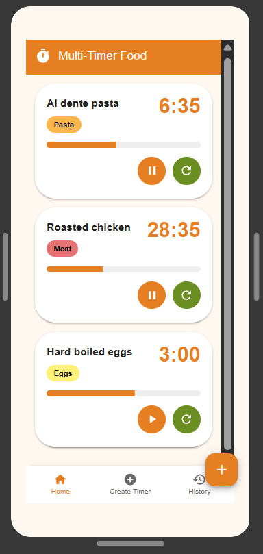
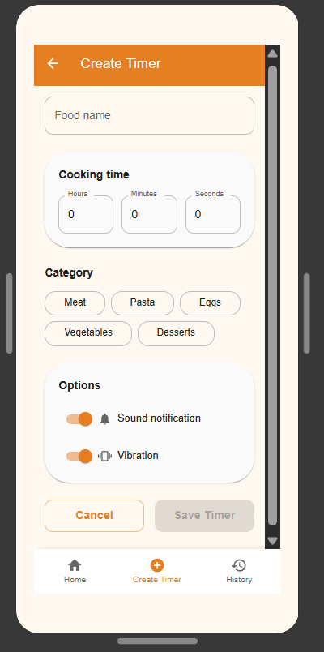
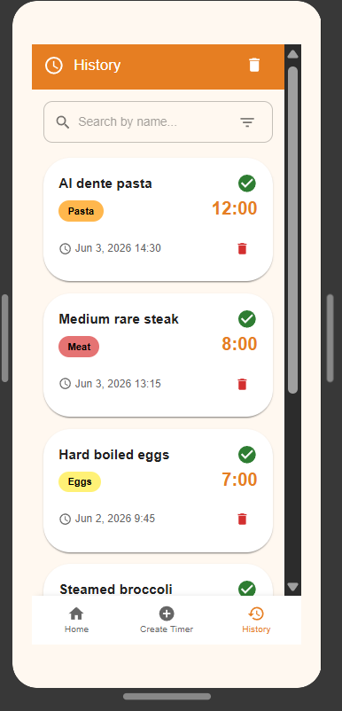

# Multi-Timer Food

## Descripción

**Multi-Timer Food** es una aplicación móvil Android diseñada para ayudar a las personas que cocinan varios alimentos al mismo tiempo. Muchas veces, al preparar diferentes platos simultáneamente, resulta difícil controlar los tiempos de cocción de cada uno, lo que puede provocar alimentos sobrecocinados o mal cocidos.

La aplicación permite crear y gestionar múltiples temporizadores independientes, facilitando el seguimiento de cada preparación y ayudando al usuario a organizar mejor su proceso de cocina.

---

## Problema que resuelve

Cuando una persona cocina varios alimentos al mismo tiempo, suele utilizar un único temporizador o recordar mentalmente los tiempos de cocción. Esto puede ocasionar errores, olvidos y una mala gestión del tiempo en la cocina.

**Multi-Timer Food** resuelve este problema permitiendo crear varios temporizadores simultáneos, cada uno asociado a un alimento específico.

---

## Objetivo de la aplicación

Desarrollar una aplicación Android que permita gestionar múltiples temporizadores de cocina de forma sencilla, ayudando a los usuarios a controlar los tiempos de cocción de diferentes alimentos simultáneamente y mejorando la organización durante la preparación de comidas.

---

## Historias de Usuario (MVP)

### HU01 – Crear temporizador

**Como** usuario,
**quiero** crear un nuevo temporizador indicando el nombre del alimento y el tiempo de cocción,
**para** organizar mejor la preparación de mis comidas.

### HU02 – Iniciar temporizador

**Como** usuario,
**quiero** iniciar un temporizador creado,
**para** comenzar el conteo del tiempo de cocción.

### HU03 – Pausar y reanudar temporizador

**Como** usuario,
**quiero** pausar y reanudar un temporizador,
**para** adaptar el control del tiempo según sea necesario.

### HU04 – Recibir notificación al finalizar

**Como** usuario,
**quiero** recibir una alerta cuando un temporizador termine,
**para** saber cuándo un alimento está listo.

### HU05 – Consultar historial

**Como** usuario,
**quiero** visualizar un historial de temporizadores utilizados,
**para** revisar preparaciones anteriores.

---

## Tecnologías utilizadas

* Android Studio
* Kotlin
* Jetpack Compose
* Material Design 3
* Android SDK

---

## Instalación

1. Clonar el repositorio:

```bash
git clone https://github.com/Kev5418/Multi-Timer-Food.git
```

2. Abrir el proyecto en Android Studio.

3. Esperar la sincronización de Gradle.

4. Ejecutar la aplicación en un emulador Android o dispositivo físico.

---

## Capturas de pantalla

### Pantalla Principal



### Crear Temporizador



### Historial



---

## Prototipo

Diseñado en Figma mediante el prototipo:

**Multi-TimerFood_Prototipo_Kevin_Yuquilema**

---

## Estado actual del proyecto

🚧 En desarrollo (MVP)

Funcionalidades implementadas o planificadas:

* Creación de temporizadores.
* Gestión de múltiples temporizadores.
* Inicio, pausa y reanudación.
* Historial de temporizadores.
* Interfaz desarrollada con Jetpack Compose.

---

## Autor

**Kevin Yuquilema**

Proyecto académico desarrollado para la asignatura de Desarrollo de Aplicaciones Móviles.
